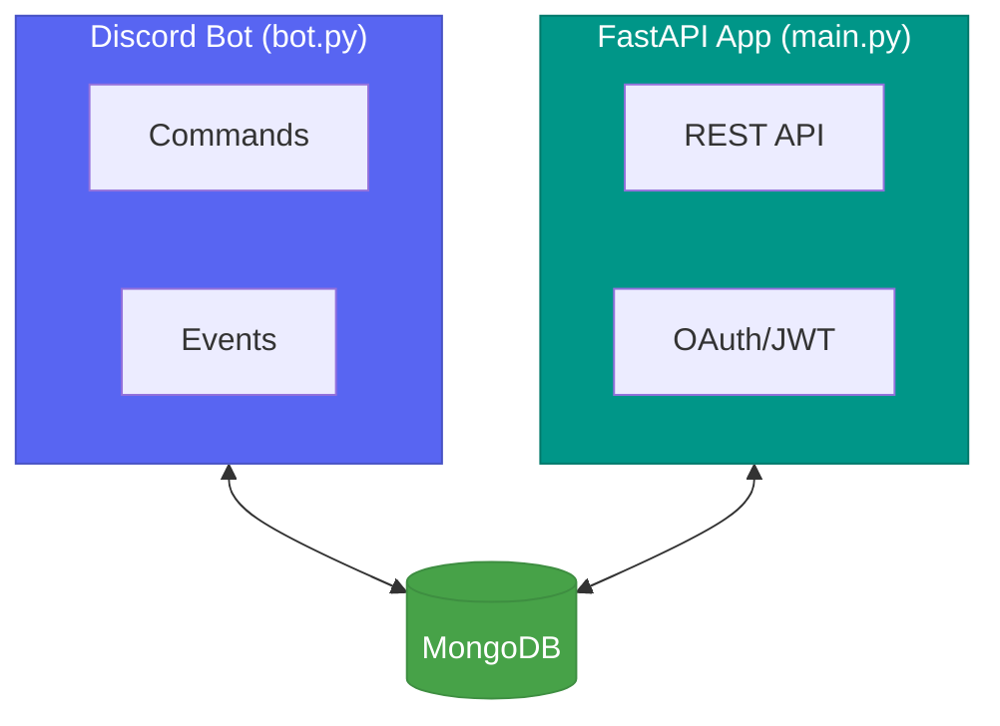

# Debrief


[](https://codecov.io/gh/jordanleeevans/debrief)


A Discord bot powered by Google's Gemini AI that extracts and analyzes Call of Duty: Black Ops 7 game statistics from screenshot images.


## Contents

- [Features](#features)
- [Quick Start](#quick-start)
- [Configuration](#configuration)
- [Discord Commands](#discord-commands)
- [REST API](#rest-api)
- [Architecture](#architecture)

---

## Quick Start

**Prerequisites:** Docker, [Discord Bot Token](https://discord.com/developers/docs/intro), [Google Gemini API Key](https://aistudio.google.com/)

```bash
# Clone and configure
git clone <repository-url>
cd debrief
cp .env.example .env

# Edit .env with your tokens
# Start services
docker compose up --build -d

# Or use watch mode for development
docker compose watch
```

## Configuration

Create `.env` in the project root:

```env
DISCORD_BOT_TOKEN=your_discord_bot_token
GEMINI_API_KEY=your_gemini_api_key
MONGODB_URI=mongodb://mongo:27017
MONGODB_DB=scoreboard_db
JWT_SECRET_KEY=your_secret_key_here
DISCORD_CLIENT_ID=your_discord_client_id
DISCORD_CLIENT_SECRET=your_discord_client_secret
DISCORD_REDIRECT_URI=http://localhost:8000/auth/callback
```

## Discord Commands

| Command | Description | Usage |
|---------|-------------|-------|
| `!ping` | Health check | `!ping` |
| `!stats` | Extract stats from screenshots (1-2 images, <10MB each) | `!stats` + attach images |
| `!query` | Natural language database queries | `!query how many kills on Raid?` |

## REST API

**Base URL:** `http://localhost:8000`
**Docs URL:** `http://localhost:8000/docs`

### Authentication
- **`GET /auth/login`** - Initiate Discord OAuth flow
- **`GET /auth/callback`** - OAuth callback (redirected from Discord)

### Matches (Protected)
- **`GET /api/matches`** - List user's matches
  - Query params: `limit` (1-100, default: 10), `skip` (default: 0)
  - Requires: `Authorization: Bearer <jwt_token>`

## Architecture

### Process Separation



- **bot.py** - Discord bot process with command handlers
- **main.py** - FastAPI REST API with OAuth and JWT authentication
- **MongoDB** - Shared database for both services

### CQRS Pattern

**Commands**
- `AnalyzeImagesCommand` → Analyze game screenshots
- `QueryDatabaseCommand` → Query match database

**Events**
- `GameStatsAnalyzed` → Stats extracted from images
- `MatchSaved` → Match persisted to database
- `QueryExecuted` → Database query completed

**Flow:**
1. Discord command → Command created
2. CommandBus executes handler (1:1)
3. Handler emits Event(s)
4. EventDispatcher notifies subscribers (1:many)
5. Subscribers react (save to DB, send Discord message, etc.)

---

**Tech Stack:** FastAPI · Discord.py · Pydantic · MongoDB · Google Gemini · Docker · pytest
