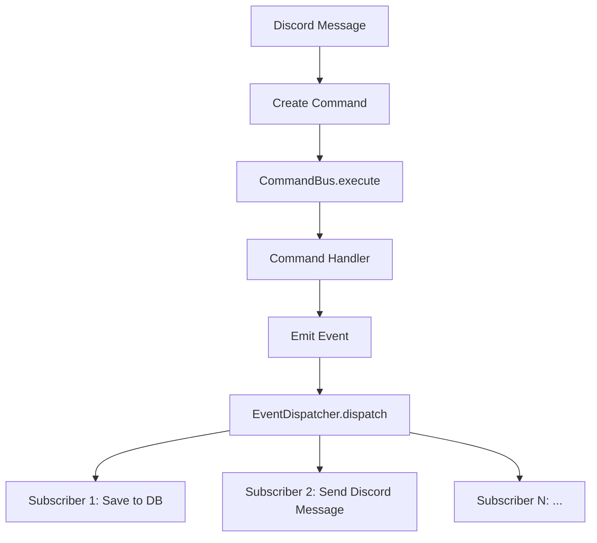

# CQRS Pattern

Debrief implements a lightweight **Command Query Responsibility Segregation (CQRS)** pattern for the Discord bot's message handling.

## Why CQRS?

Instead of putting all logic inside Discord command handlers, Debrief separates concerns:

- **Commands** represent an _intent_ (e.g., "analyze these images")
- **Handlers** execute the command and produce **Events**
- **Events** represent something that _happened_ (e.g., "stats were analyzed")
- **Subscribers** react to events (save to DB, send Discord message, etc.)

This makes the code testable, extensible, and loosely coupled.

## Flow Diagram



## Commands

Commands are simple data classes that carry the intent and necessary data.

| Command | Description |
|---------|-------------|
| `AnalyzeImagesCommand` | Analyze attached game screenshots |
| `QueryDatabaseCommand` | Execute a natural language database query |

### Command Bus

The `CommandBus` maps each command type to exactly **one** handler (1:1 relationship):

```python
# Registering a handler
bus.register(AnalyzeImagesCommand, analyze_handler)

# Executing a command
result = await bus.execute(command)
```

## Events

Events are emitted by command handlers after processing completes.

| Event | Triggered When |
|-------|----------------|
| `GameStatsAnalyzed` | Screenshots successfully analyzed by Gemini |
| `MatchSaved` | Match data persisted to MongoDB |
| `QueryExecuted` | Database query completed |

### Event Dispatcher

The `EventDispatcher` maps each event type to **one or many** subscribers (1:N relationship):

```python
# Registering subscribers
dispatcher.subscribe(GameStatsAnalyzed, save_to_db)
dispatcher.subscribe(GameStatsAnalyzed, send_discord_response)

# Dispatching an event
await dispatcher.dispatch(event)
```

## End-to-End Example

Here's what happens when a user sends `!stats` with a screenshot:

1. Discord.py receives the message
2. An `AnalyzeImagesCommand` is created with the image attachments
3. The `CommandBus` routes it to the analysis handler
4. The handler calls Gemini AI to extract stats → emits `GameStatsAnalyzed`
5. The `EventDispatcher` notifies subscribers:
   - **DB handler** saves the match → emits `MatchSaved`
   - **Discord handler** formats and sends the response to the channel
