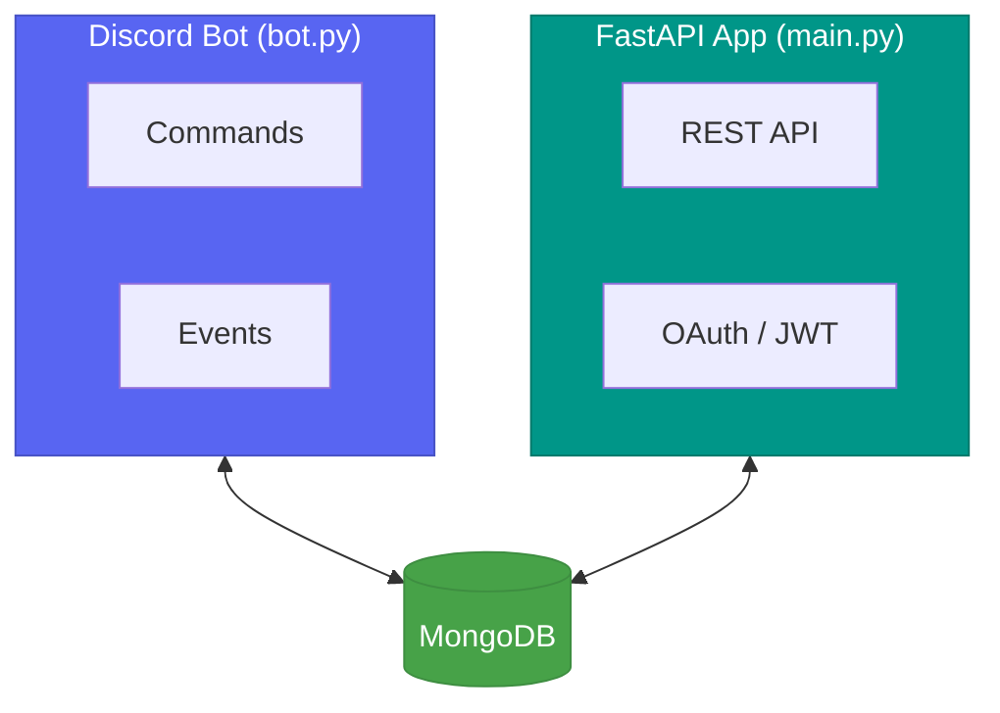

# Architecture Overview

Debrief uses a multi-process architecture with a shared MongoDB database.

## System Diagram



## Process Separation

Debrief runs as **two independent processes** that share a database:

| Process | Entry Point | Purpose |
|---------|-------------|---------|
| Discord Bot | `bot.py` | Handles Discord commands and events |
| FastAPI API | `app.api.main:app` | REST API with OAuth and JWT auth |

Both are containerized via Docker Compose and connect to the same MongoDB instance.

## Project Structure

```
app/
├── api/                  # FastAPI REST API
│   ├── main.py           # App factory & startup
│   └── routes.py         # API route definitions
├── bot/                  # Discord bot
│   ├── main.py           # Bot startup & client
│   ├── utils.py          # Utility functions
│   ├── commands/          # CQRS command layer
│   │   ├── bus.py         # Command bus (dispatch)
│   │   └── commands.py    # Command definitions
│   ├── events/            # CQRS event layer
│   │   ├── dispatcher.py  # Event dispatcher
│   │   └── events.py      # Event definitions
│   └── handlers/          # Side-effect handlers
│       ├── db.py          # MongoDB operations
│       ├── discord.py     # Discord response formatting
│       └── gemini.py      # Gemini AI integration
├── shared/               # Shared across bot & API
│   ├── auth/              # Authentication (OAuth, JWT)
│   ├── core/              # Settings & config
│   ├── db/                # Database connection
│   ├── models/            # Pydantic schemas & enums
│   ├── repositories.py    # Data access layer
│   └── services/          # External service clients
└── tests/                # Test suite
    ├── integration/       # Integration tests
    ├── mocks/             # Test doubles
    └── unit/              # Unit tests
```

## Key Design Decisions

- **Process isolation** — The bot and API run independently, avoiding coupling
- **Shared `app/shared/`** — Common code (models, DB, auth) lives in a shared package
- **CQRS pattern** — Commands and events separate write intentions from side effects  
- **Dependency injection** — Handlers receive dependencies, enabling easy testing
