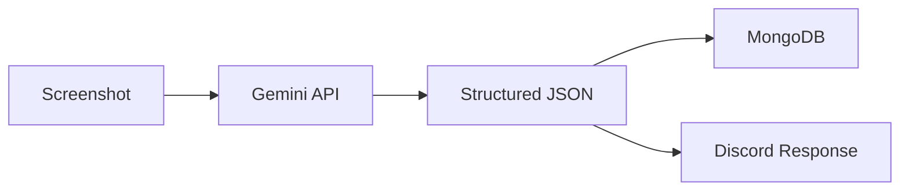
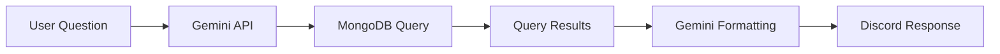

# AI Analysis

Debrief uses Google's Gemini AI for two core capabilities: **screenshot analysis** and **natural language database queries**.

## Screenshot Analysis

When a user sends the `!stats` command with attached images, Gemini processes the screenshots to extract structured game data.

### How It Works

1. **Image input** — The raw screenshot bytes are sent to the Gemini API
2. **AI extraction** — Gemini identifies and extracts fields like map, mode, kills, deaths, score, etc.
3. **Validation** — The extracted data is validated against [Pydantic schemas](/docs/schemas)
4. **Persistence** — Valid match data is stored in MongoDB
5. **Response** — A formatted summary is returned to Discord

### Supported Data

Gemini attempts to extract any visible statistics from Call of Duty post-match scoreboards, including but not limited to:

- Map name and game mode
- Player statistics (kills, deaths, assists, score)
- Team-level information
- Match outcome (win/loss)

---

## Natural Language Queries

The `!query` command lets users ask questions about their match data in plain English.

### How It Works

1. **Question input** — The user's natural language question is sent to Gemini
2. **Query generation** — Gemini translates the question into a MongoDB query/aggregation
3. **Execution** — The generated query runs against the matches collection
4. **Formatting** — Results are formatted into a human-readable Discord message

### Example Queries

| Question | What Gemini Generates |
|----------|----------------------|
| "How many kills on Raid?" | `db.matches.aggregate([{$match: {map: "Raid"}}, {$group: {_id: null, total: {$sum: "$kills"}}}])` |
| "What's my best game?" | `db.matches.find().sort({kills: -1}).limit(1)` |
| "How many matches have I played?" | `db.matches.countDocuments({})` |

:::caution
AI-generated queries are best-effort. Complex or ambiguous questions may produce unexpected results.
:::
