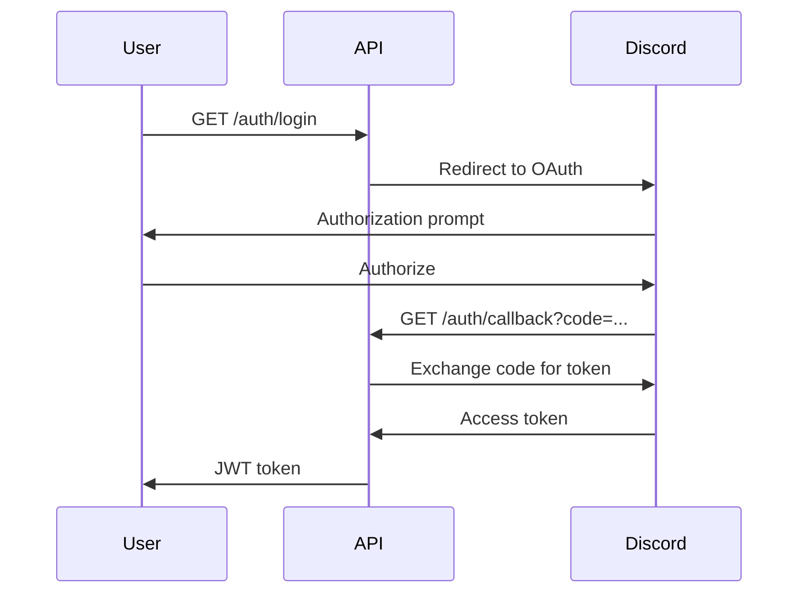

# REST API

Debrief exposes a FastAPI-powered REST API for programmatic access to match data.

**Base URL:** `http://localhost:8000`  
**Interactive Docs:** `http://localhost:8000/docs`

## Authentication

The API uses Discord OAuth2 for login and JWT tokens for subsequent requests.

### Login Flow



### Endpoints

#### `GET /auth/login`

Initiates the Discord OAuth2 flow. Redirects the user to Discord's authorization page.

#### `GET /auth/callback`

Handles the OAuth callback from Discord. Exchanges the authorization code for an access token and returns a JWT.

---

## Matches

All match endpoints require authentication via a JWT bearer token.

### `GET /api/matches`

Retrieve the authenticated user's match history.

**Headers:**
```
Authorization: Bearer <jwt_token>
```

**Query Parameters:**

| Parameter | Type | Default | Description |
|-----------|------|---------|-------------|
| `limit` | int | 10 | Number of matches to return (1–100) |
| `skip` | int | 0 | Number of matches to skip |

**Example Request:**
```bash
curl -H "Authorization: Bearer eyJhbG..." \
  "http://localhost:8000/api/matches?limit=5&skip=0"
```

**Example Response:**
```json
{
  "matches": [...],
  "count": 1,
  "skip": 0,
  "limit": 10
}
```

### Response Schema

Each match is validated against the [`GameStatsResponse`](/docs/schemas#gamestatsresponse) Pydantic schema before being stored. This enforces correct types, value ranges, and enum membership — so only sanitised data is returned by this endpoint.

Every match includes shared fields ([`map`](/docs/schemas#maps), [`team`](/docs/schemas#teams), [`game_mode`](/docs/schemas#gamemodes), weapon stats) but the `scoreboard` object varies by game mode, each with its own Pydantic model:

| Game Mode | Scoreboard Model | Mode-Specific Fields |
|-----------|-----------------|---------------------|
| Hardpoint | [`HardpointScoreboard`](/docs/schemas#hardpointscoreboard) | `time`, `objective_captures`, `objective_kills`, `captures` |
| Overload | [`OverloadScoreboard`](/docs/schemas#overloadscoreboard) | `overloads`, `overload_devices_carrier_killed` |
| Search and Destroy | [`SearchAndDestroyScoreboard`](/docs/schemas#searchanddestroyscoreboard) | `plants`, `defuses`, `objective_kills`, `objective_score` |

All three scoreboard types share a common base from [`Scoreboard`](/docs/schemas#scoreboard) (`player`, `eliminations`, `deaths`, `elimination_death_ratio`, `score`, `friendly_score`, `enemy_score`).
